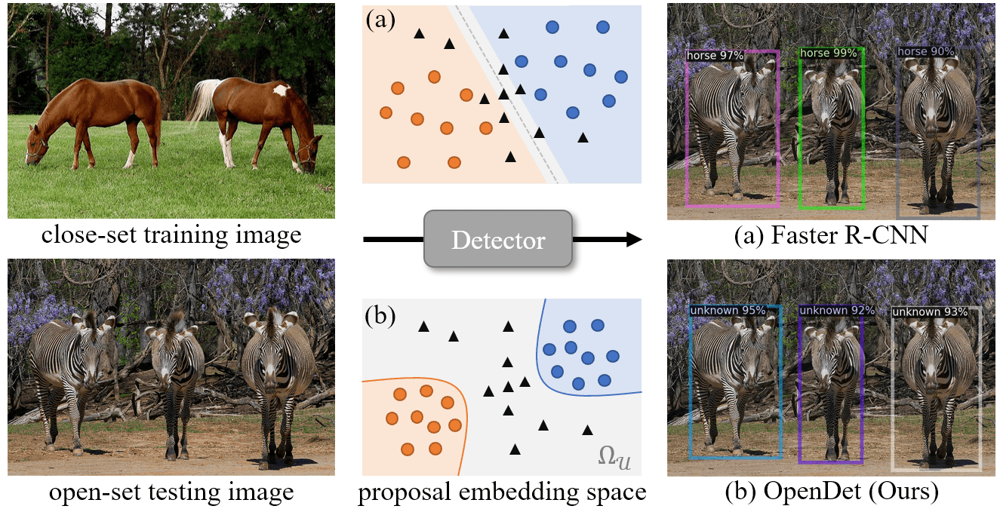

## OpenDet



> **Expanding Low-Density Latent Regions for Open-Set Object Detection (CVPR2022)**<br>
> [Jiaming Han](https://csuhan.com), [Yuqiang Ren](https://github.com/Anymake), [Jian Ding](https://dingjiansw101.github.io), [Xingjia Pan](https://scholar.google.com.hk/citations?user=NaSU3eIAAAAJ&hl=zh-CN), Ke Yan, [Gui-Song Xia](http://www.captain-whu.com/xia_En.html).<br>
> [arXiv preprint](https://arxiv.org/abs/2203.14911).

OpenDet2: OpenDet is implemented based on [detectron2](https://github.com/facebookresearch/detectron2).

### Setup

The code is based on [detectron2 v0.5](https://github.com/facebookresearch/detectron2/tree/v0.5). 

* **Installation** 

Here is a from-scratch setup script.

```
conda create -n opendet2 python=3.8 -y
conda activate opendet2

conda install pytorch=1.8.1 torchvision cudatoolkit=10.1 -c pytorch -y
pip install detectron2==0.5 -f https://dl.fbaipublicfiles.com/detectron2/wheels/cu101/torch1.8/index.html
git clone https://github.com/csuhan/opendet2.git
cd opendet2
pip install -v -e .
```

* **Prepare datasets** 

Please follow [datasets/README.md](datasets/README.md) for dataset preparation. Then we generate VOC-COCO datasets.

```
bash datasets/opendet2_utils/prepare_openset_voc_coco.sh
# using data splits provided by us.
cp datasets/voc_coco_ann datasets/voc_coco -rf
```

### Model Zoo

We report the results on VOC and VOC-COCO-20, and provide pretrained models. Please refer to the corresponding log file for full results.

* **Faster R-CNN**

| Method  | backbone | mAP<sub>K&uarr;</sub>(VOC) | WI<sub>&darr;</sub> | AOSE<sub>&darr;</sub> | mAP<sub>K&uarr;</sub> | AP<sub>U&uarr;</sub> |   Download   |
|---------|:--------:|:--------------------------:|:-------------------:|:---------------------:|:---------------------:|:--------------------:|:------------:|
| FR-CNN  |   R-50   |            80.06           |        19.50        |         16518         |         58.36         |           0          | [config](configs/faster_rcnn_R_50_FPN_3x_baseline.yaml) [model](https://drive.google.com/drive/folders/10uFOLLCK4N8te08-C-olRyDV-cJ-L6lU?usp=sharing) |
| PROSER  |   R-50   |            79.42           |        20.44        |         14266         |         56.72         |         16.99        | [config](configs/faster_rcnn_R_50_FPN_3x_proser.yaml) [model](https://drive.google.com/drive/folders/1_L85gisyvDtBXPe2UbI49vrd5FoBIOI_?usp=sharing) |
| ORE     |   R-50   |            79.80           |        18.18        |         12811         |         58.25         |         2.60         | [config]() [model]() |
| DS      |   R-50   |            79.70           |        16.76        |         13062         |         58.46         |         8.75         | [config](configs/faster_rcnn_R_50_FPN_3x_ds.yaml) [model](https://drive.google.com/drive/folders/1OWDjL29E2H-_lSApXqM2r8PS7ZvUNtiv?usp=sharing) |
| OpenDet |   R-50   |            80.02           |        12.50        |         10758         |         58.64         |         14.38        | [config](configs/faster_rcnn_R_50_FPN_3x_opendet.yaml) [model](https://drive.google.com/drive/folders/10uFOLLCK4N8te08-C-olRyDV-cJ-L6lU?usp=sharing) |
| OpenDet |  Swin-T  |            83.29           |        10.76        |          9149         |         63.42         |         16.35        | [config](configs/faster_rcnn_Swin_T_FPN_3x_opendet.yaml) [model](https://drive.google.com/drive/folders/1j5SkEzeqr0ZnGVVZ4mzXSOvookHfvVvm?usp=sharing) |

* **RetinaNet**

| Method         | mAP<sub>K&uarr;</sub>(VOC) | WI<sub>&darr;</sub> | AOSE<sub>&darr;</sub> | mAP<sub>K&uarr;</sub> | AP<sub>U&uarr;</sub> |     Download     |
|----------------|:--------------------------:|:-------------------:|:---------------------:|:---------------------:|:--------------------:|:----------------:|
| RetinaNet      |            79.63           |        14.16        |         36531         |         57.32         |           0          | [config](configs/retinanet_R_50_FPN_3x_baseline.yaml) [model](https://drive.google.com/drive/folders/15fHfyA2HuXp6LfdTMBuHG6ZwtLcgvD-p?usp=sharing) |
| Open-RetinaNet |            79.64           |        10.74        |         17208         |         57.32         |         10.55        | [config](configs/retinanet_R_50_FPN_3x_opendet.yaml) [model](https://drive.google.com/drive/folders/1uLRZ5bdGaoORWaP2huiyL_WyLicmWT4G?usp=sharing) |


**Note**:
* You can also download the pre-trained models at [github release](https://github.com/csuhan/opendet2/releases) or [BaiduYun](https://pan.baidu.com/s/1I4Pp40pM84aeYTNeGc0kPA) with extracting code ABCD.
* The above results are reimplemented. Therefore, they are slightly different from our paper.
* The official code of ORE is at [OWOD](https://github.com/JosephKJ/OWOD). So we do not plan to include ORE in our code. 

### Online Demo

Try our online demo at [huggingface space](https://huggingface.co/spaces/csuhan/opendet2).

### Train and Test

* **Testing**

First, you need to download pretrained weights in the model zoo, e.g., [OpenDet](https://drive.google.com/drive/folders/10uFOLLCK4N8te08-C-olRyDV-cJ-L6lU?usp=sharing).

Then, run the following command:
```
python tools/train_net.py --num-gpus 8 --config-file configs/faster_rcnn_R_50_FPN_3x_opendet.yaml \
        --eval-only MODEL.WEIGHTS output/faster_rcnn_R_50_FPN_3x_opendet/model_final.pth
```

* **Training**

The training process is the same as detectron2.
```
python tools/train_net.py --num-gpus 8 --config-file configs/faster_rcnn_R_50_FPN_3x_opendet.yaml
```

To train with the Swin-T backbone, please download [swin_tiny_patch4_window7_224.pth](https://github.com/SwinTransformer/storage/releases/download/v1.0.0/swin_tiny_patch4_window7_224.pth) and convert it to detectron2's format using [tools/convert_swin_to_d2.py](tools/convert_swin_to_d2.py).
```
wget https://github.com/SwinTransformer/storage/releases/download/v1.0.0/swin_tiny_patch4_window7_224.pth
python tools/convert_swin_to_d2.py swin_tiny_patch4_window7_224.pth swin_tiny_patch4_window7_224_d2.pth
```


### Citation

If you find our work useful for your research, please consider citing:

```BibTeX
@InProceedings{han2022opendet,
    title     = {Expanding Low-Density Latent Regions for Open-Set Object Detection},
    author    = {Han, Jiaming and Ren, Yuqiang and Ding, Jian and Pan, Xingjia and Yan, Ke and Xia, Gui-Song},
    booktitle = {Proceedings of the IEEE/CVF Conference on Computer Vision and Pattern Recognition (CVPR)},
    year      = {2022}
}
```